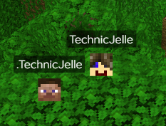
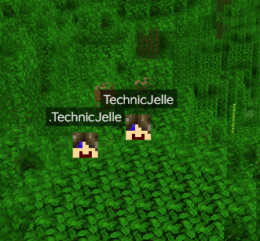

# BlueMap Floodgate

A Minecraft Paper plugin and [BlueMap](https://github.com/BlueMap-Minecraft/BlueMap) addon that adds [Geyser/Floodgate](https://github.com/GeyserMC/Floodgate) support:
by default, floodgate players don't have the correct playerhead image on BlueMap. This plugin fixes that.

| Without                                                  | With                                               |
|----------------------------------------------------------|----------------------------------------------------|
|  |  | 

You can safely reload the config by reloading BlueMap itself with `/bluemap reload`.

### Config
- `configVersion_DO_NOT_TOUCH`
  - Do not touch this one! It's needed internally to keep track of the config versions.
- `cacheHours: 72`
  - How long to keep the playerheads cached for. The lower this number, the faster skin updates will appear, but the more network usage there will be.
- `verboseLogging: true`
  - Set to `true` if you want more messages telling you what the plugin is up to.
- `customAPI: ''`
  - **This option is hidden by default, but you can add it to the config manually.**
  - If you want to use a custom skin API, you can set it here. Keep empty or removed if you want to use my own custom skin grabber.\
    Please tell me if you do use a custom skin API, because I genuinely want to know why anyone would want to do that.
  - Make sure the API returns a full skin image, not just the head.
  - Available placeholders: `{UUID}`, `{NAME}` (case sensitive)\
    If there was no placeholder found in the URL, the UUID will be appended to the end of the URL.

## [Click here to download!](../../releases/latest)

## [TODO list](../../projects/1?fullscreen=true)

## Support
To get support with this plugin, join the [BlueMap Discord server](https://bluecolo.red/map-discord) and ask your questions in [#3rd-party-support](https://discord.com/channels/665868367416131594/863844716047106068). You're welcome to ping me, @TechnicJelle.

## Special thanks to
[Camotoy](https://github.com/Camotoy/GeyserSkinManager) for their open-source plugins that gave me great examples to learn from.\
And [TBlueF](https://github.com/TBlueF) of course for his amazing plugin and fast support with my silly questions!
